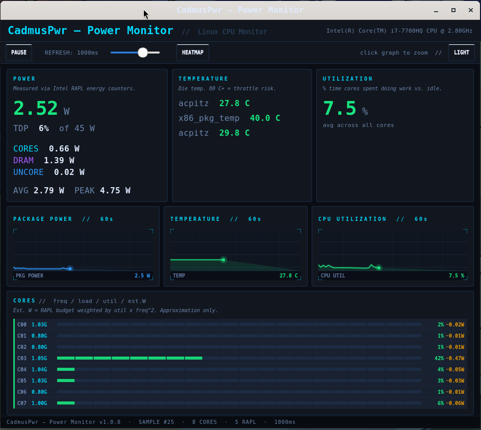

# CadmusPwr — Linux 

A native GTK3/C desktop app for monitoring Intel CPU power, temperature, frequency, and utilization on Linux. Inspired by Intel Power Gadget.

Runs natively on Wayland and X11. Zero polling daemons, no DBus - reads directly from `sysfs` and `procfs`.
> Developed and tested on **Fedora 42, Wayland, Intel i7-7700HQ**.
>
> Works on any Linux distro with GTK3 and an Intel RAPL-capable CPU (Sandy Bridge 2011+).



---

## Features

- **Package, core, DRAM, and uncore power** via Intel RAPL — direct hardware energy counters, no estimation
- **TDP %** from `constraint_0_power_limit_uw`
- **Per-core frequency and utilisation** for all logical CPUs, from `/proc/stat` and `cpufreq`
- **Per-core estimated power** — RAPL budget distributed by `util × freq²`
- **CPU temperature** from all matching thermal zones (`x86_pkg_temp`, `acpitz`, `cpu-thermal`)
- **Thermal throttle detection** — banner appears when any zone hits 100 °C
- **60-second rolling graphs** with glow, scanlines, corner brackets
- **Click-to-zoom** any graph to full width
- **Per-core heatmap view** — colour grid for all cores at a glance
- **Dark / light theme** toggle
- **Pause / resume** data collection
- **Adjustable refresh rate** — 250 ms / 500 ms / 1 s / 2 s

---

## Requirements

| Requirement | Details |
|---|---|
| OS | Any Linux distro |
| Kernel | 3.13+ (RAPL), 4.x+ recommended |
| CPU | Intel with RAPL support (Sandy Bridge 2011+) |
| Desktop | Wayland or X11 |
| GTK | GTK3 (pre-installed on GNOME desktops) |
| Compiler | GCC or Clang |
| Permissions | Root, or relaxed powercap permissions (see below) |

---

## Project structure
 
```
linux/
├── Makefile
├── CadmusPwr.c       ← entire app, single translation unit (~1,970 lines)
├── CadmusPwr.png     ← app icon (place here before make desktop)
└── CadmusPwr.desktop ← generated by make desktop (gitignored)
```
 
---

## Build dependencies

GTK3 is already installed on your GNOME desktops. You only need the development headers:

```bash
# Fedora
sudo dnf install gtk3-devel

# Ubuntu / Debian
sudo apt install libgtk-3-dev

# Arch
sudo pacman -S gtk3
```

---

## Build
 
### Option A — Makefile (recommended)
 
```bash
# One-time: set permanent RAPL read permissions
make udev
 
# Compile binary into .build/
make
 
# Compile and install to ~/.local/bin
make install
 
# Install .desktop entry + icon for GNOME launcher
make desktop
 
# Refresh icon cache if icon doesn't appear
make update-icon-cache
 
# Remove binary and .desktop entry
make uninstall
 
# Remove .build/ directory
make clean
 
# List all targets
make help
```
 
### Makefile target reference
 
| Target | What it does |
|---|---|
| `make` | Compile binary → `.build/CadmusPwr` |
| `make install` | Compile + copy to `~/.local/bin/CadmusPwr` |
| `make desktop` | Install icon + `.desktop` entry for GNOME launcher |
| `make update-icon-cache` | Refresh GTK icon cache |
| `make udev` | Write permanent RAPL udev rule (run once) |
| `make uninstall` | Remove binary, `.desktop`, and icon |
| `make clean` | Delete `.build/` |
| `make help` | List targets |
 
### Option B — Direct compile
 
```bash
gcc -O2 -Wall -o CadmusPwr CadmusPwr.c $(pkg-config --cflags --libs gtk+-3.0) -lm
```

---

## Permissions — RAPL setup
 
RAPL energy counters require elevated read access by default.
 
### Option 1 — Permanent udev rule (recommended, run once)
 
```bash
make udev
```
 
Survives reboots. After this, run `./CadmusPwr` without sudo.
 
### Option 2 — Run with sudo (always works, no setup)
 
```bash
sudo ~/.local/bin/CadmusPwr
```
 
### Option 3 — One-time chmod (resets on reboot)
 
```bash
sudo chmod o+r /sys/class/powercap/intel-rapl:*/energy_uj
sudo chmod o+r /sys/class/powercap/intel-rapl:*:*/energy_uj
```

---
## Why this is needed

The app reads:

- `/sys/class/powercap/...` → restricted
- `/proc/stat` → OK
- `/sys/class/thermal/...` → usually OK

Without permissions:

- CPU usage works
- Temperature may work
- ❌ Power shows 0.00 W

---

## App icon and GNOME launcher
 
Place `CadmusPwr.png` in the project directory, then:
 
```bash
make desktop
```
 
This installs the icon to `~/.local/share/icons/hicolor/256x256/apps/` and writes the `.desktop` entry. Search "CadmusPwr" in GNOME Activities, then right-click → **Pin to Dash**.

`.desktop` should look like:

```ini
[Desktop Entry]
Name=CadmusPwr
Comment=CPU Power Monitor
Exec=/home/YOUR_USERNAME/.local/bin/CadmusPwr
Icon=~/.local/share/icons/hicolor/256x256/apps/CadmusPwr.png
Terminal=false
Type=Application
Categories=Utilities;System;Monitor;
```
 
If the icon doesn't appear immediately:
 
```bash
make update-icon-cache
```

---

## What it measures

### Package Power (RAPL)

Source: `/sys/class/powercap/intel-rapl:*/energy_uj`

RAPL (Running Average Power Limit) reads hardware energy counters in microjoules, diffed across each sample interval to compute average watts. On Linux, all sub-domains are real hardware readings - no estimation needed.

| Domain | What it covers |
|---|---|
| Package | Entire CPU socket |
| Core | CPU cores + L1/L2 cache |
| DRAM | Memory controller + RAM |
| Uncore | iGPU and ring fabric |

TDP% is calculated from: `/sys/class/powercap/intel-rapl:0/constraint_0_power_limit_uw`

### Per-core Frequency

Source: `/sys/devices/system/cpu/cpu*/cpufreq/scaling_cur_freq` - current frequency per logical core from the cpufreq governor, in GHz.

### CPU Utilization

Source: `/proc/stat` — per-CPU idle/total counters diffed between samples. `util% = 100 × (1 − Δidle / Δtotal)`

### Temperature

Source: `/sys/class/thermal/thermal_zone*/temp` — all zones with type `x86_pkg_temp`, `acpitz`, or `cpu-thermal`, in °C. Throttle warning fires at 100 °C.

### Per-core estimated power
 
RAPL core domain budget distributed across logical CPUs by `util × (freq / max_freq)²`. Shown with `~` prefix — approximation, not a direct measurement.

### Graphs

All graphs show a 60-second rolling history. The Y-axis scales automatically:
- Power graph scales to TDP (or peak seen, whichever is higher)
- Temperature graph scales to 100°C
- Utilization graph scales to 100%

---

## Colour coding

| Colour | Meaning |
|---|---|
| Green | Low / healthy — power < 30 W, temp < 60 °C, util < 50% |
| Amber | Moderate — power 30–60 W, temp 60–80 °C, util 50–80% |
| Red | High / critical — power > 60 W, temp > 80 °C, util > 80% |
| Cyan | Frequency labels, accent |
| Blue | Package power graph line |

Thresholds: power < 30W = green, 30–60W = yellow, > 60W = red. Temperature < 60°C = green, 60–80°C = yellow, > 80°C = red.

---

## Troubleshooting

**"No RAPL power domains found" on launch** — RAPL files aren't readable. Run `make udev` or use sudo.

To verify RAPL is available on your system:

```bash
ls /sys/class/powercap/
# Should show: intel-rapl:0  intel-rapl:0:0  etc.
```

If that directory is empty, load the kernel modules:

```bash
sudo modprobe intel_rapl_common
sudo modprobe intel_rapl_msr
```

---

**Window appears but Power shows 0.00 W** — This usually means the energy counter files are readable but returning 0. Double-check permissions:
 
```bash
cat /sys/class/powercap/intel-rapl:0/energy_uj
# Should print a large number like 12345678901
```

If that returns 0 or permission denied, revisit the permissions section.

---

**No temperature shown** — thermal zones may use different type names.

Some systems don't expose the expected thermal zone types. Check what's available:

```bash
for z in /sys/class/thermal/thermal_zone*/; do
  echo "$z: $(cat $z/type) = $(cat $z/temp)"
done
```

If you see zones with different type names, the source code can be adjusted — look for the `discover_thermal()` function and add your zone type to the `strstr` checks.

---

**`pkg-config: command not found (at build itme)`**

```bash
# Fedora
sudo dnf install pkgconfig

# Ubuntu
sudo apt install pkg-config
```

---

**Running in a VM** — RAPL is not available in most virtual machines. 

The app will show the error dialog and exit. This is a hardware limitation — the hypervisor blocks direct energy counter access. Running on a real physical Intel machine is required.

---

## Future concepts that could be added
 
- **Fan RPM** — read from `hwmon` sysfs (`/sys/class/hwmon/*/fan*_input`)
- **Energy since launch** — integrate watts × time to show Wh consumed this session
- **CSV / JSON export** — log timestamped readings to a file
- **Desktop notifications** — alert when power exceeds a configurable threshold
- **AMD CPU support** — AMD also exposes RAPL via the `amd_energy` kernel module

---

## Changelog

See [CHANGELOG.md](CHANGELOG.md).

---

## License

MIT — see [LICENSE](https://github.com/ccot7/cadmus-pwr/blob/main/LICENSE).

---

## 👤 Author
**Cadmus of Tyre**  
GitHub: [@ccot7](https://github.com/ccot7)

---
> *The sentinel for your CPU's power, thermals, and performance limits.*
